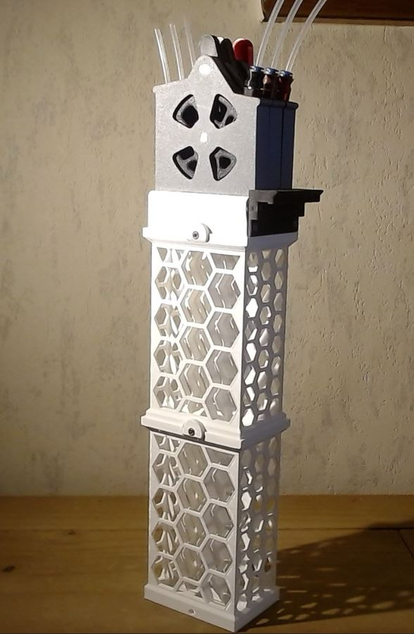
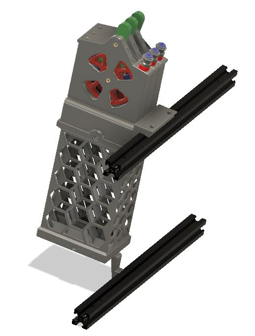
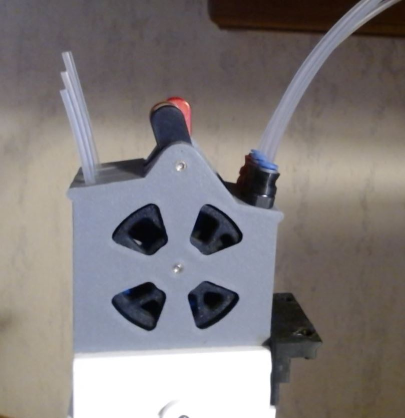
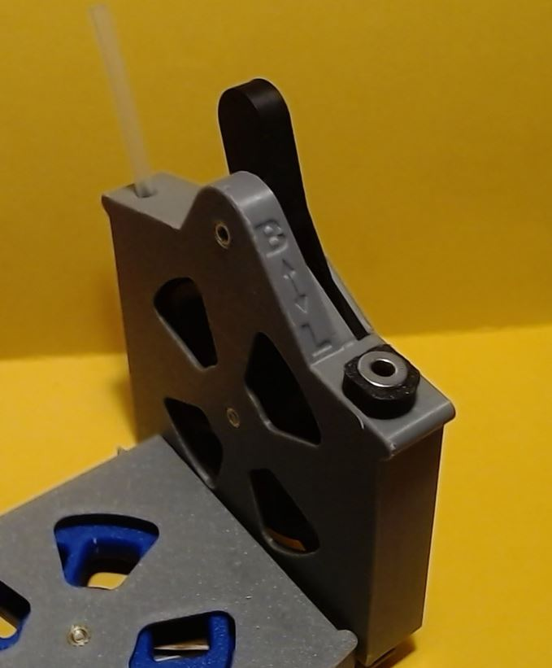
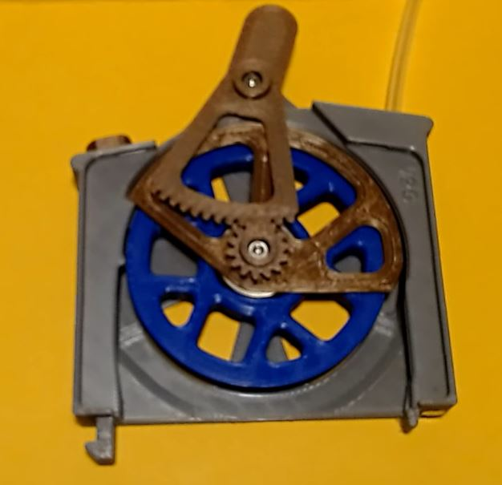

# Under construction : be patient...

<h1 align="center"><ins>Easy-Buffer</ins></h1>

<H2 align="center">ERCF Buffer with assisted loading function for ERCF V2.</H1>

## What is it ?

**Easy-Buffer** is based on single loop buffer like Quiver or the Prusa MMU2 Filament Retract Bank. It can be associated to the ERCT-lite, for people that can't use the official Cotton Tail (ERCT)

It consists of :
  * 150mm high stackable buffer towers.
  * A interface block.
  * 3 individual heads.
        The heads are composed of :
        * a case with cover.
        * a wheel.
        * a filament guide.
        * a lever.
        * an magnetic PTFE output.

Using the pre-gate function of Happy Hare, the loading of the filament in the ERCF takes only a few seconds from the insertion into the buffer to the parking in the filament block.

To load the filament, simply move the lever to the **L** position, and insert the filament until it reaches the ERCF gate. Happy Hare will pull it and push it back to the parking position. At this moment, filp the lever to the **B** position. That's it. It is ready for printing.
  

  

  

## Summary.
* **[Bom](#bom)**
* **[Printing tips](#printing-tips)**   
* **[Cleaning tips](#cleaning-tips)**
* **[Assembling tips](#assembling-tips)**

## BOM.
For each buffer head you need :  
   * 2 M3x12 SHSC screws. 
   * 2 M3 inserts.
   * 1 6x3 magnets.
   * 2 10x3x4 magnet (with 4mm hole).
   * 1 ECAS (on the filament path).
   * 1 optional sprint 3.7x7 spring (0.5mm wire). 
   * 1 optional 4mm ball.
   * 1 608ZZ bearing

For each buffer tower you need :
   * 2 M3 inserts.
   * 2 M3x6 SHSC screws. 

For each interface plate you need :
   * 6 M3 inserts.
   * 2 M3x6 SHSC screws. 
   * 4 M3x8 SHSC screws.

## **Printing tips:**
   I have printed the parts in PLA with the following settings :
   * 4 perimeters
   * 25% infill
     
## **Cleaning-tips:**
   The tolerances are quite tight, depending on your printer, you may need to clean the guide and lever holes so they turn freely.

## **Assembling-tips:**
   Coming soon