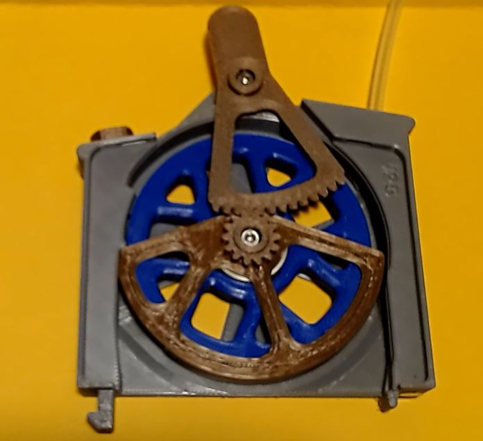

<h1 align="center"><ins>Easy-Buffer</ins></h1>

<H2 align="center">ERCF Buffer with assisted loading function for ERCF V2.</H1>

## What is it ?

**Easy-Buffer** is based on single loop buffer like Quiver or the Prusa MMU2 Filament Retract Bank. It can be associated to the ERCT-lite, for people that can't use the official Cotton Tail (ERCT)

The bottom clamp is designed to hold 3 buffer towers on a Voron 2.4 350. For other printer, the clamp should be redesigned.
Using 3 Buffer Towers, it will be possible to buffer **1000mm** of filament. 

It consists of :
  * 150mm high stackable buffer towers.
  * An interface block.
  * 3 individual heads.
        The heads are composed of :
        * a case with cover.
        * a wheel.
        * a filament guide.
        * a lever.
        * an magnetic PTFE output.

Using the pre-gate function of Happy Hare, the loading of the filament in the ERCF takes only a few seconds from the insertion into the buffer to the parking in the filament block.

To load the filament, simply move the lever to the **L** position, and insert the filament until it reaches the ERCF gate. Happy Hare will pull it and push it back to the parking position. At this moment, filp the lever to the **B** position. That's it. It is ready for printing.
  

  

  

## Summary.
* **[Bom](#bom)**
* **[Printing tips](#printing-tips)**   
* **[Cleaning tips](#cleaning-tips)**
* **[Assembling tips](#assembling-tips)**
* **[How to use it](#how-to-use-it)**

## BOM.
For each buffer head you need :  
   * 2 M3x12 SHSC screws. 
   * 2 M3 inserts.
   * 1 6x3 magnets.
   * 2 10x4x4 magnets (with 4mm hole).
   * 1 ECAS (on the filament path).
   * 1 optional sprint 3.7x7 spring (0.5mm wire). 
   * 1 optional 4mm ball.
   * 1 608ZZ bearing

For each buffer tower you need :
   * 2 M3 inserts.
   * 2 M3x6 SHSC screws. 

For each interface plate you need :
   * 6 M3 inserts.
   * 2 M3x6 SHSC screws. 
   
For the 2020 mounting plate yu need :
   * 6 M3 hammer nuts
   * 2 M3x8 SHCS

For the bottom clamp (only for Voron V2-350)
   * 1 M3x12 SHCS
   * 1 M3 Hammer nuts

## **Printing tips:**
   * I have printed the parts in PLA with the following settings :
     * 4 perimeters.
     * 3 top and bottom layers.
     * 25% infill.

   * Since the lever gear is quite thin, I advice to print at least one spare lever. With all the tests I've made, I never had one that failed, but we never know. Only time will tell. 
  
     
## **Cleaning-tips:**
   * Remove all supports. (see assembly instructions)
     * The big support on the guide can easily be removed with a spatula used to remove print off of the bed. Insert it at easiest point, and work your way around until it is completely free from the guide.

   * The tolerances are quite tight, depending on your printer, you may need to clean the guide and lever holes, so they turn freely.

   * Remove the "elephant foot" especially on the lever gear.

   * To get a smoother flip of the lever after the filament has been loaded, you should smooth out the layer steps on the guide with a file or sand paper.  You can also spray a bit of dry lubricant on those areas.

   
  

## **Assembling-tips:**

   * The provided Bottom Clamp is designed to hold a 3 Buffer towers on a Voron 2.4-350mm. 
   * Insert a short PTFE tube into the 4mm hole on the top of the Head. This is the entry side.
   * Insert an ECAS or the provided magnet holder into the hole at the other side of the head. The magnet holder is a bayonet type.

   * [Assembly instructions.pdf](Assembly_instructions.pdf)

## **How to use it:**
The Easy Buffer Head has 2 functions 
   1. Load the filament easily into the ERCF. It is even easier if you use the pre-gates switched of Happy Hare that will park the filament into the filament block for you.
   2. Allow the filament to go down into the buffer towers.
    
* **Loading the filament**  
  It is recommended to insert the filament into the head with the natural curve of the filament following the wheel.
  1. Flip the lever to the "L" position.
  2. Insert the filament into to small PTFE tube at the entry side until it comes out on the exit side. From there you can either:
     1. leave it there to insert it later into ERCF
     2. keep pushing on the entry side until it get into the ERCF, and if you have pre-gates sensors, Happy Hare will pull it and park it in the filament block.
  3. Once the filament is loaded or at least out of the head at the exit side. Flip the lever to the "B" position. This will move the guide over the filament, and make the system ready for buffering the filament. *It is best to move the lever in a **single fast move** otherwise it could stop in the middle of its travel.*

Once the lever is on the "B" position, it will not be possible to move it to the "L" position until the filament is completely removed.

  * **What the lever does not move fully to the "B" position**
      The whole system relies on the guide sliding over the filament. To do this, the guide must also bend the filament slightly over a short length. Depending on the type and smoothness of your filament, it is possible that the guide has problem to slide over or bend the filament.
      In that case, pushing a bit the filament coming from the spool into the head to release pressure will normally allow the lever to go to the "B" position.  

